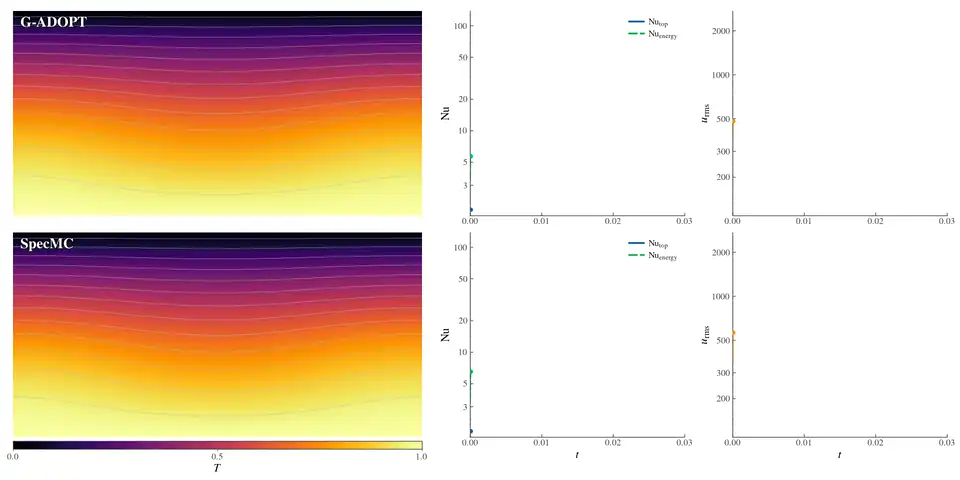

# SpecMC

SpecMC (Spectral Mantle Convection) is a spectral solver for mantle convection. It
addresses a single question: how the rock deep inside the Earth actually flows over
hundreds of millions of years. The core heats the base, the surface radiates to
space, hot material rises while cold material sinks, and viscosity varies with
temperature by several orders of magnitude, so plumes, cold drips and mantle
overturns gradually emerge.

SpecMC writes this process as coupled equations for temperature, velocity and
pressure and solves them with a set of smooth spectral expansions. Unlike
representative finite element solvers such as ASPECT, CitcomS and G-ADOPT, it
natively outputs spectral coefficients, which preserves resolution independence and
provides a unified data representation for later neural operator acceleration,
aiming to make mantle convection simulation reproducible, verifiable and suited to
acceleration while retaining spectral accuracy.

## Features

| Feature | Status | Notes |
|:---|:---:|:---|
| Spectral discretisation | ✅ | Fourier × Chebyshev, exponential convergence |
| Variable viscosity | ✅ | `const` / `eta_z` / `eta_T` / `arrhenius` |
| Internal heating | ✅ | Constant volumetric rate `H` |
| Viscous dissipation | ✅ | `(Di/Ra)·Φ` |
| Truncated Anelastic Liquid Approximation | 🟡 | Reduces to Boussinesq at `Di = 0`; physical applicability not fully validated |
| Thermochemical field | ❌ | Composition not implemented |

✅ implemented and validated, 🟡 implemented with a documented restriction,
❌ not implemented.

## Governing equations

Momentum and continuity, with the Rayleigh number explicit in the buoyancy term,

$$-\nabla\cdot\left[\eta\left(\nabla\mathbf u+\nabla\mathbf u^{\mathsf T}\right)\right]+\nabla p=Ra\,\theta\,\hat{\mathbf e}_z,
\qquad \nabla\cdot\mathbf u=0,$$

and the temperature equation for the perturbation $\theta$ about the conductive
background $\bar T(z)=1-z$,

$$\frac{\partial\theta}{\partial t}+\mathbf u\cdot\nabla\theta-u_z=\nabla^2\theta+H+\frac{Di}{Ra}\,\Phi,
\qquad T=\bar T+\theta .$$

The default domain is the $1\times1$ box with free-slip boundaries, isothermal
top and bottom and insulating side walls.

### Notation

| Symbol | Meaning | Configuration field |
|:---|:---|:---|
| `Ra` | Rayleigh number at the reference (maximum) viscosity | `Ra` |
| `H` | constant volumetric (internal/radiogenic) heating rate | `internal_heating` |
| `Di` | dissipation number; the shear-heating source enters as `(Di/Ra) Φ` | `dissipation_number` |
| `Lx`, `Nx`, `Nz` | domain width, horizontal nodes, vertical nodes | `Lx`, `Nx`, `Nz` |

## Method

Fourier modes horizontally and Chebyshev polynomials vertically give exponential
convergence for smooth solutions. Eliminating pressure and velocity through a
stream function reduces the Stokes problem to one scalar operator per horizontal
wavenumber, factorised once and reused while the viscosity field is unchanged.
Momentum and temperature advance together, implicit in time with second-order
extrapolation of advection and buoyancy, under a CFL-limited adaptive step size.
Variable viscosity enters the Stokes operator as a nonlinear coefficient and is
resolved iteratively each step, never lagged by a full time step.

### Rheology

| `viscosity_model` | Law | Notes |
|:---|:---|:---|
| `const` | `eta = 1` | isoviscous reference state that defines `Ra` |
| `eta_z` | `eta = exp(-ln(Δη_T) (1 - z))` | depth-dependent only |
| `eta_T` | `eta = exp(-ln(Δη_T) T)` | temperature-dependent |
| `arrhenius` | `eta = exp(E/(T+Ts) - E/Ts)` | activated creep, with an optional reference-pressure term |

The exponential and Arrhenius laws are calibrated to the same endpoints
`eta(0) = 1`, `eta(1) = 1/Δη_T`, so switching between them changes the profile
rather than the total contrast. An explicit `[eta_min, eta_max]` window bounds the
pointwise viscosity.

## Benchmarks

### Blankenbach benchmark (1989)

Reference values are those of Blankenbach et al. (1989), Geophysical Journal
International 98, 23-38, Table 9. `Nu` is the volume-averaged Nusselt number and
`Vrms` the root-mean-square velocity.

| Case | `Ra` | `Δη_T` | Grid | Quantity | specmc | Reference | Rel. error |
|:---|:---|:---|:---|:---|---:|:---:|---:|
| Blankenbach 1a | `1e4` | 1 | 32 × 24 | `Nu` | 4.884405 | 4.884409 | −8.2e-7 |
| | | | | `Vrms` | 42.864728 | 42.864947 | −5.1e-6 |
| Blankenbach 1a | `1e4` | 1 | 64 × 48 | `Nu` | 4.885140 | 4.884409 | +1.5e-4 |
| | | | | `Vrms` | 42.872720 | 42.864947 | +1.8e-4 |
| Blankenbach 2a | `1e4` | 1000 | 64 × 96 | `Nu` | 10.0379 | 10.066 | −2.8e-3 |

### G-ADOPT cross-solver comparison

The same time-dependent problem solved by G-ADOPT and by SpecMC, with `Ra = 1.25e4`,
`H = 1.5` and `Δη_T = 1000` in a 2:1 box, on a 96 × 48 Q2 grid and a 64 × 96
spectral grid respectively. Each cell gives G-ADOPT / SpecMC, followed in
parentheses by the relative difference of G-ADOPT with respect to SpecMC.

| Quantity | t = 0.01 | t = 0.02 | t = 0.03 |
|:---|:---:|:---:|:---:|
| `Nu_top` | 7.671377 / 7.677637 (−0.082%) | 10.367692 / 10.383834 (−0.155%) | 10.704652 / 10.674088 (+0.286%) |
| `Nu_energy` | 4.293412 / 4.301560 (−0.189%) | 9.770147 / 9.588460 (+1.895%) | 10.773700 / 10.799785 (−0.242%) |
| `u_rms` | 148.2698 / 149.9220 (−1.102%) | 465.7610 / 452.4449 (+2.943%) | 522.8772 / 527.9716 (−0.965%) |

[](assets/gadopt_vs_specmc_ra12500_h1.5.mp4)

## Usage

```
import specmc
from specmc.core import bench_ic

cfg = specmc.ConvectionConfig(
    Ra=1e4,                # Rayleigh number at the reference viscosity
    viscosity_model="eta_T",
    deta_T=1000.0,         # eta(T=0) / eta(T=1)
    Nx=32, Nz=24,
)

model = specmc.api.build_model(cfg)
theta = bench_ic.conductive_theta(model, amp=3e-2, m=1, n=1)
theta, info = specmc.api.march_adaptive(model, theta, tstop=1e-3)

print(info["steps"], info["t"], info["dt"])
```

The public surface is small: `specmc.ConvectionConfig` describes a scenario,
`specmc.api.build_model` builds it, `specmc.api.march` and
`specmc.api.march_adaptive` advance it, `specmc.api.describe` dumps the
configuration and the numerics it implies, and `specmc.api.load_checkpoint` reads
a stored state without the solver.

## Layout

```
SpecMC/
├── specmc/                     # The solver package
│   ├── __init__.py             # Exports ConvectionConfig, api, _numerics
│   ├── config.py               # ConvectionConfig: the scenario and its validation
│   ├── api.py                  # build_model / march / march_adaptive / describe / load_checkpoint
│   ├── _numerics.py            # Fixed internal numerical constants, unreachable from a config
│   ├── core/                   # Discretisation and time marching, physics-free
│   │   ├── __init__.py         # Package marker, imports nothing
│   │   ├── rbc_galerkin.py     # Chebyshev transforms and the isoviscous reference solver
│   │   ├── cfl_policy.py       # Single source of truth for the step-size limit
│   │   ├── implicit_theta.py   # Implicit temperature step with flux boundary conditions
│   │   ├── krylov_fgmres.py    # Flexible GMRES with per-iteration residual history
│   │   └── bench_ic.py         # Benchmark initial conditions for the Blankenbach cases
│   ├── models/                 # Assembled solvers, one per physical scenario
│   │   ├── __init__.py         # Package marker, imports nothing
│   │   ├── convection_modes.py # make_convection factory and the eta(z) model
│   │   ├── coupled_model.py    # eta(T): coupled Stokes, lagged factorisation, defect correction
│   │   ├── const.py            # The isoviscous scenario
│   │   ├── eta_z.py            # The depth-dependent scenario
│   │   └── eta_T.py            # The temperature-dependent scenario, the default
│   ├── physics/                # Material laws and source terms
│   │   ├── __init__.py         # Package marker, imports nothing
│   │   ├── viscosity.py        # The eta(T) and eta(z) laws, with their published provenance
│   │   ├── arrhenius.py        # The activated-creep law, with and without the pressure term
│   │   ├── eta_bounds.py       # The [eta_min, eta_max] window and its smooth limiting
│   │   ├── heating.py          # Constant internal heating and its conductive reference state
│   │   ├── dissipation.py      # The viscous dissipation source and the energy budget it closes
│   │   ├── reference_state.py  # Profiles that anchor the pressure-dependent law
│   │   └── compressibility.py  # The TALA reference state
│   ├── stokes/                 # Variable-viscosity Stokes operators
│   │   ├── __init__.py         # Package marker, imports nothing
│   │   ├── vv_stokes.py        # Per-wavenumber direct solve for eta(z)
│   │   ├── stokes_coupled.py   # The eta(x,z) operator and its block preconditioner
│   │   ├── lagged_stokes.py    # One lagged factorisation plus the adaptive Picard correction
│   │   ├── bfbt.py             # The spectral BFBT preconditioner
│   │   └── stokes_tala.py      # The TALA operator
│   └── io/                     # Run-tree checkpoint input and output
│       ├── __init__.py         # Re-exports checkpoint
│       └── checkpoint.py       # Atomic checkpoint write, list, latest and read
├── assets/                     # Media used by this document
│   ├── gadopt_vs_specmc_ra12500_h1.5.webp  # The looping clip shown above
│   └── gadopt_vs_specmc_ra12500_h1.5.mp4   # The clip at 1280 × 640
├── pyproject.toml              # Package metadata and the two runtime dependencies
├── LICENSE                     # MIT
└── README.md                   # This document
```
